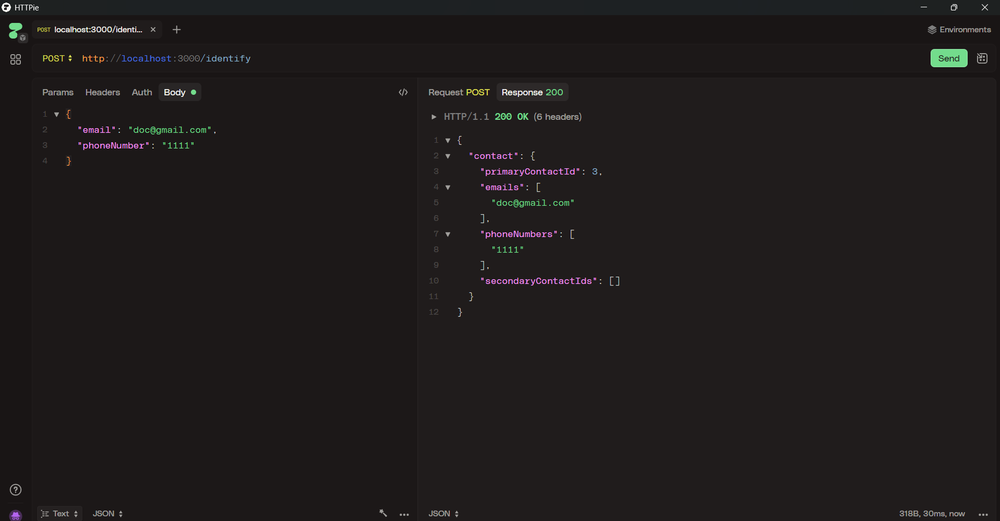
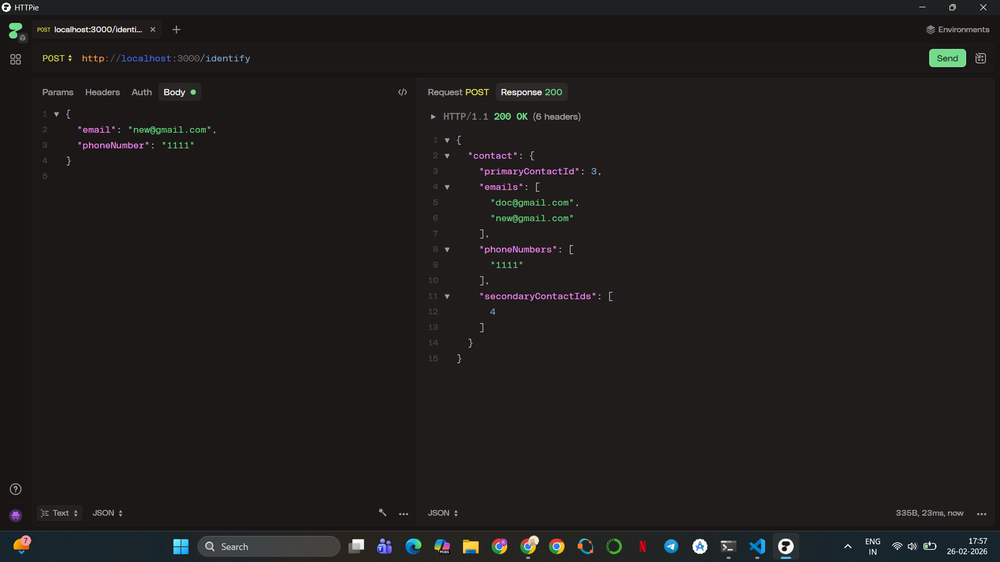

# Bitespeed Backend Task – Identity Reconciliation

## Overview

This project implements the Identity Reconciliation backend task.

Customers may place orders using different email addresses and phone numbers.  
The goal is to identify and link contact records that belong to the same person and return a consolidated response.

The system maintains a primary contact and links all related contacts as secondary.

---

## Tech Stack

- Node.js  
- TypeScript  
- Express.js  
- Prisma ORM  
- SQLite  

---

## Database Schema

### Contact Model Fields

- id (Int, Primary Key, Auto Increment)  
- email (String, Nullable)  
- phoneNumber (String, Nullable)  
- linkedId (Int, Nullable – references primary contact)  
- linkPrecedence ("primary" or "secondary")  
- createdAt (DateTime)  
- updatedAt (DateTime)  
- deletedAt (DateTime, Nullable)  

---

## Identity Logic

- If no contact matches the incoming email or phone number → create a new primary contact.

- If a matching contact exists:
  - The oldest contact remains primary.
  - New information is stored as a secondary contact if required.

- If a request links two different primary contacts:
  - The oldest primary remains primary.
  - The newer primary is converted to secondary.
  - linkedId is updated.
  - All contact details are consolidated.

---

## API Endpoint

**POST /identify**

### Request Body Example

```json
{
  "email": "example@gmail.com",
  "phoneNumber": "123456"
}
```

At least one of the fields must be provided.

---

### Response Format

```json
{
  "contact": {
    "primaryContactId": 1,
    "emails": ["example@gmail.com"],
    "phoneNumbers": ["123456"],
    "secondaryContactIds": []
  }
}
```

---

## Example Test Cases (HTTPie)

### 1️⃣ Primary Contact Creation

```json
{ "email": "doc@gmail.com", "phoneNumber": "1111" }
```



---


### 2️⃣ Merge Two Primaries

```json
{ "email": "a@gmail.com", "phoneNumber": "9999" }
{ "email": "b@gmail.com", "phoneNumber": "8888" }
{ "email": "a@gmail.com", "phoneNumber": "8888" }
```



---


## Running Locally

### Clone the repository
```
git clone <your-repo-url>
cd bitespeed
```

### Install dependencies
```
npm install
```

### Run migration
```
npx prisma migrate dev
```

### Start server
```
npx ts-node-dev src/index.ts
```

Server runs at:

```
http://localhost:3000
```

---

## Features Implemented

- Primary contact creation  
- Secondary contact creation  
- Primary merge logic  
- Linked contact retrieval  
- Deduplication of emails and phone numbers  
- Structured JSON response  
- SQLite database integration  

---

## Author

Rakshitha C
